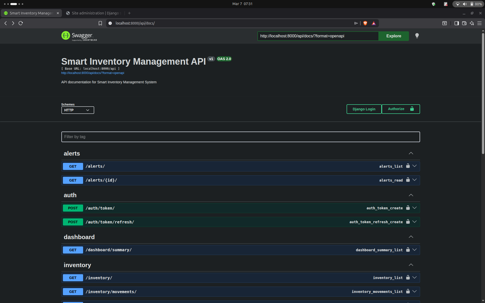
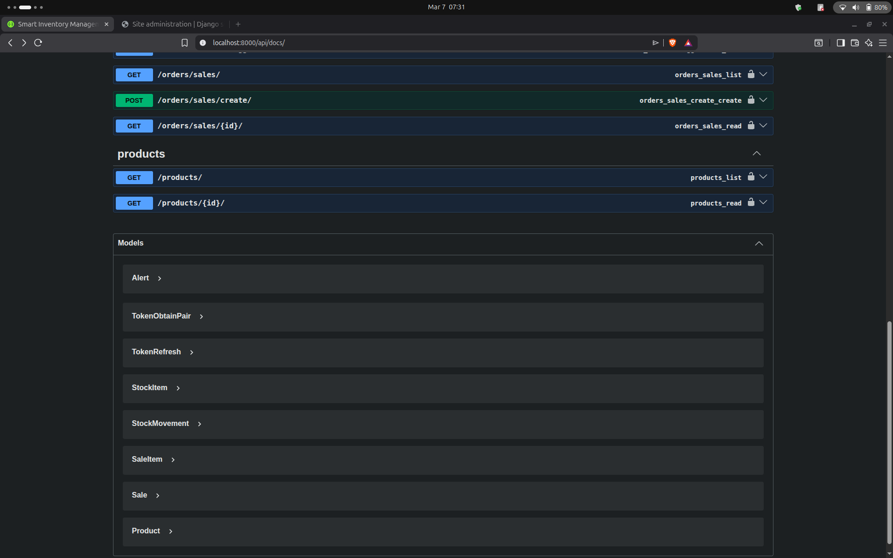
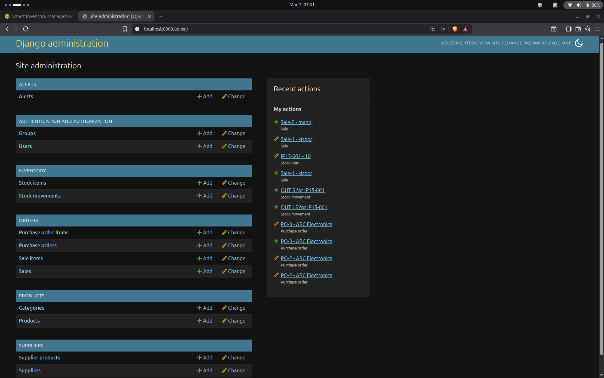
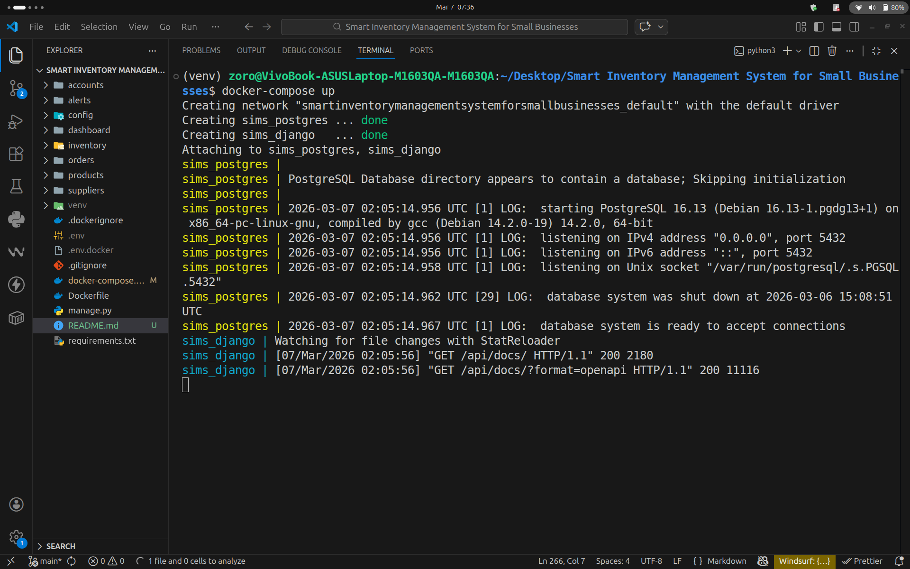

# 📦 Smart Inventory Management System

<div align="center">


**A REST API for managing inventory, suppliers, orders, and stock alerts for small businesses.**

[Features](#-features) • [Tech Stack](#-tech-stack) • [Getting Started](#-getting-started) • [API Docs](#-api-documentation) • [Project Structure](#-project-structure) • [Docker](#-running-with-docker)

</div>

---

## 🚀 About The Project

The **Smart Inventory Management System** is a backend REST API built as a final year BCA project. It helps small businesses track products, manage stock levels, handle purchase orders and sales, and get AI-powered reorder suggestions — all through a secure, documented API.

Key highlights:
- 🔐 **JWT Authentication** — secure token-based login with access and refresh tokens
- 📦 **Real-time stock tracking** — auto-updates on every sale or purchase
- 🔔 **Automatic low-stock alerts** — triggered when stock drops below reorder level
- 🤖 **Smart reorder suggestions** — based on current stock vs reorder thresholds
- 🐳 **Fully Dockerized** — runs with a single command
- 📄 **Swagger API docs** — auto-generated interactive documentation

---

## ✨ Features

| Feature | Description |
|---|---|
| 🏷️ Product Management | Add, update, delete products with categories and SKU |
| 📊 Inventory Tracking | Real-time stock levels with full movement history |
| 🏢 Supplier Management | Manage suppliers linked to products |
| 🛒 Purchase Orders | Create and approve purchase orders — auto-updates stock |
| 💰 Sales Recording | Record sales — auto-deducts from inventory |
| 🔔 Low-Stock Alerts | Alerts generated when stock falls below reorder level |
| 🤖 Reorder Suggestions | Suggests reorder quantities based on inventory thresholds |
| 📈 Dashboard | Summary stats including total products, stock value, and orders |
| 🔐 JWT Auth | Secure token-based authentication with refresh tokens |
| 📄 Swagger Docs | Interactive API documentation at `/api/docs/` |
| 🐳 Docker Deployment | Full Docker Compose setup with all services |

---

## 🛠 Tech Stack

| Layer | Technology |
|---|---|
| **Framework** | Django 6.0.3 + Django REST Framework 3.16.1 |
| **Database** | PostgreSQL |
| **Authentication** | JWT via SimpleJWT 5.5.1 |
| **API Documentation** | Swagger (drf-yasg 1.21.15) |
| **Containerization** | Docker + Docker Compose |

---

## 📁 Project Structure

```
smart-inventory-management-system/
│
├── config/                  # Project settings and urls
│   ├── settings.py
│   └── urls.py
│
├── accounts/                # User auth and JWT
├── products/                # Products and categories
├── inventory/               # Stock tracking and transactions
├── suppliers/               # Supplier management
├── orders/                  # Purchase orders and sales
├── alerts/                  # Low-stock alert system
├── dashboard/               # Summary stats and reorder suggestions
│
├── manage.py
├── requirements.txt
├── Dockerfile
├── docker-compose.yml
└── .env.example
```

---

## ⚙️ Getting Started (Local Setup)

### Prerequisites
- Python 3.12+
- PostgreSQL

### 1. Clone the repository
```bash
git clone https://github.com/itesh-singh/smart-inventory-management-system.git
cd smart-inventory-management-system
```

### 2. Create and activate virtual environment
```bash
python3 -m venv venv
source venv/bin/activate        # Linux/Mac
venv\Scripts\activate           # Windows
```

### 3. Install dependencies
```bash
pip install -r requirements.txt
```

### 4. Configure environment variables

Create a `.env` file in the root directory:
```env
SECRET_KEY=your-secret-key-here
DEBUG=True
DB_NAME=inventory_db
DB_USER=postgres
DB_PASSWORD=your-password
DB_HOST=localhost
DB_PORT=5432
```

### 5. Run migrations
```bash
python manage.py makemigrations
python manage.py migrate
```

### 6. Create superuser
```bash
python manage.py createsuperuser
```

### 7. Start the development server
```bash
python manage.py runserver
```

---

## 🐳 Running with Docker

> Runs the entire system (Django + PostgreSQL) with **one command.**

### 1. Clone the repo and configure `.env`
```bash
git clone https://github.com/itesh-singh/smart-inventory-management-system.git
cd smart-inventory-management-system
cp .env.example .env   # then edit .env with your values
```

### 2. Build and start all containers
```bash
docker-compose up --build
```

### 3. Run migrations inside container
```bash
docker-compose exec web python manage.py migrate
docker-compose exec web python manage.py createsuperuser
```

The app will be live at **http://localhost:8000**

---

## 📄 API Documentation

Interactive Swagger docs available at:
```
http://localhost:8000/api/docs/
```

### 🔑 Authentication
| Method | Endpoint | Description |
|---|---|---|
| POST | `/api/auth/register/` | Register new user |
| POST | `/api/auth/token/` | Login — get access + refresh token |
| POST | `/api/auth/token/refresh/` | Refresh access token |

### 📦 Products
| Method | Endpoint | Description |
|---|---|---|
| GET | `/api/products/` | List all products |
| POST | `/api/products/` | Create a product |
| GET | `/api/products/{id}/` | Get product detail |
| PUT | `/api/products/{id}/` | Update product |
| DELETE | `/api/products/{id}/` | Delete product |

### 📊 Inventory
| Method | Endpoint | Description |
|---|---|---|
| GET | `/api/inventory/` | List stock levels |
| POST | `/api/inventory/transactions/` | Record stock in/out |
| GET | `/api/inventory/transactions/` | Full movement history |

### 🛒 Orders
| Method | Endpoint | Description |
|---|---|---|
| GET | `/api/orders/purchase-orders/` | List purchase orders |
| POST | `/api/orders/purchase-orders/` | Create purchase order |
| GET | `/api/orders/sales/` | List sales |
| POST | `/api/orders/sales/create/` | Record a sale |

### 🔔 Alerts
| Method | Endpoint | Description |
|---|---|---|
| GET | `/api/alerts/` | List all alerts |
| PATCH | `/api/alerts/{id}/read/` | Mark alert as read |

### 📈 Dashboard
| Method | Endpoint | Description |
|---|---|---|
| GET | `/api/dashboard/summary/` | Total products, stock value, orders |
| GET | `/api/dashboard/low-stock/` | Products below reorder level |
| GET | `/api/dashboard/reorder-suggestions/` | Reorder suggestions based on thresholds |

---

## 🖥️ Admin Panel

Access Django Admin at:
```
http://localhost:8000/admin/
```
Log in with the superuser credentials you created.

---

## 📸 Screenshots

### Swagger API Documentation



### Django Admin Panel


### Docker Containers Running


---

## 🔮 Future Improvements

- [ ] Web dashboard UI with charts (Chart.js)
- [ ] Email notifications for low-stock alerts
- [ ] Advanced analytics and forecasting
- [ ] Mobile app integration
- [ ] Barcode scanning support

---

## 👨‍💻 Author

**Itesh Singh**
BCA Final Year — Smart Inventory Management System

[](https://github.com/itesh-singh)
[](https://linkedin.com/in/itesh-singh-113b55323)

---

<div align="center">
⭐ If you found this project useful, please give it a star!
</div>