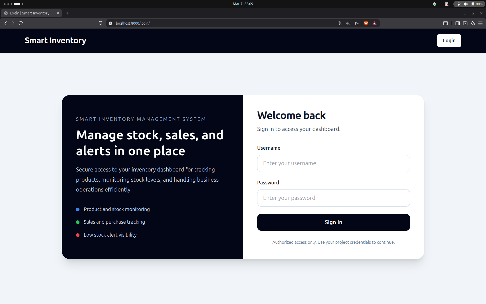
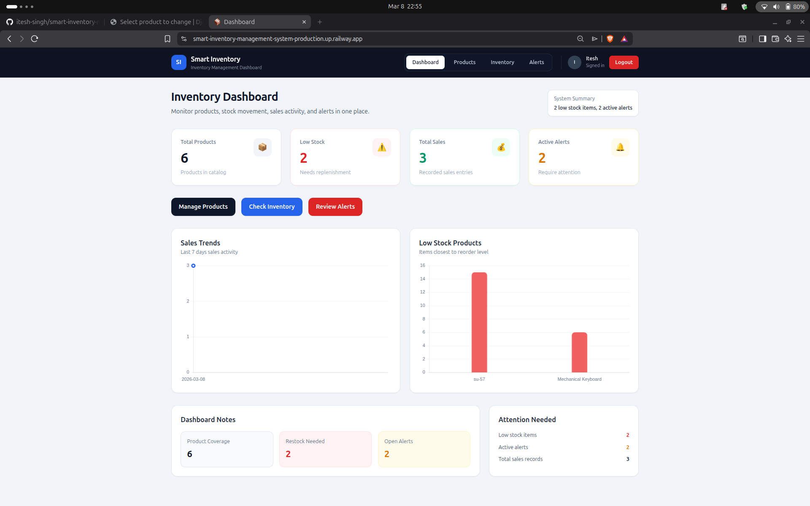
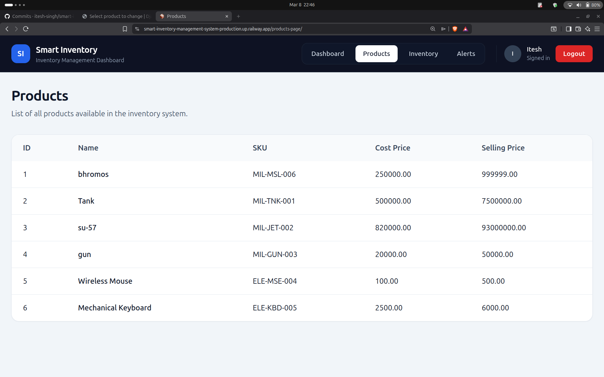
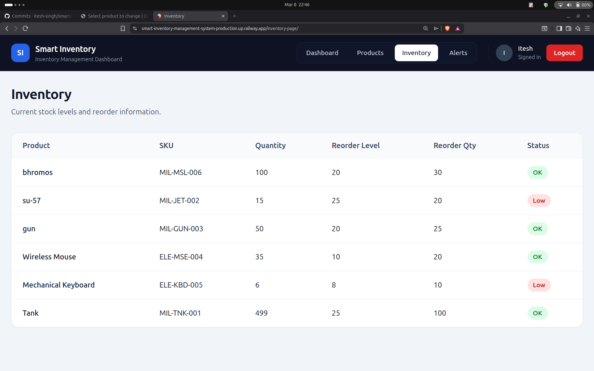
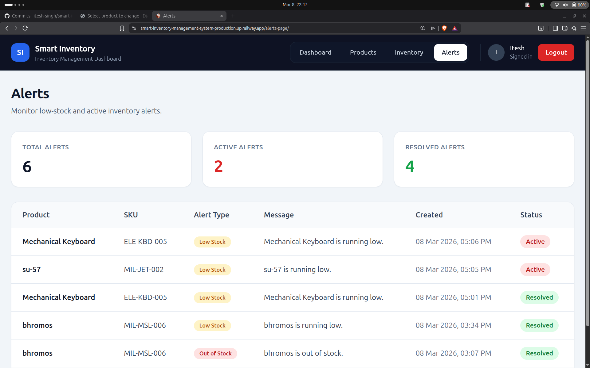

# 📦 Smart Inventory Management System

<div align="center">


**A full-stack inventory management system with a Django REST API backend and an interactive Tailwind dashboard — built for small businesses.**

🌐 **Live Demo:** https://smart-inventory-management-system-production.up.railway.app

[Features](#-features) • [Tech Stack](#-tech-stack) • [Architecture](#-architecture) • [Getting Started](#-getting-started) • [API Docs](#-api-documentation) • [Deployment](#-deployment)

</div>

---

## 🚀 About The Project

The **Smart Inventory Management System** is a full-stack web application built as a BCA Final Year Project. It helps small businesses manage products, track inventory, handle purchase orders and sales, and visualize stock data through an interactive dashboard.

Key highlights:

- 🔐 **JWT Authentication** — secure token-based login with access and refresh tokens
- 📦 **Real-time stock tracking** — auto-updates on every sale or purchase
- 🔔 **Low-stock alerts** — triggered when stock drops below reorder level
- 🤖 **Smart reorder suggestions** — based on current stock vs reorder thresholds
- 📊 **Interactive dashboard** — sales analytics and low-stock charts with Chart.js
- 🖥️ **Web UI** — Tailwind CSS dashboard for managing inventory
- 📄 **Swagger API docs** — auto-generated interactive documentation
- 🚀 **Deployed on Railway** — with Gunicorn, WhiteNoise, and PostgreSQL

---

## ✨ Features

| Feature | Description |
|---|---|
| 🏷️ Product Management | Add, update, delete products with categories and SKU |
| 📦 Inventory Tracking | Real-time stock levels with full movement history |
| 🏢 Supplier Management | Manage suppliers linked to products |
| 🛒 Purchase Orders | Create purchase orders — auto-increases stock on approval |
| 💰 Sales Recording | Record sales — auto-deducts from inventory |
| 🔔 Low-Stock Alerts | Alerts generated when stock falls below reorder level |
| 🤖 Reorder Suggestions | Suggests reorder quantities based on inventory thresholds |
| 📊 Dashboard Overview | Stats for total products, stock value, sales, and alerts |
| 📈 Sales Analytics | Chart.js visualization of sales trends |
| 📉 Low Stock Chart | Visualization of products with critically low stock |
| 🖥️ Web Dashboard | Tailwind CSS UI for managing inventory in the browser |
| 🔐 JWT Auth | Secure token-based authentication with refresh tokens |
| 📄 Swagger Docs | Interactive API documentation at `/api/docs/` |
| 🐳 Local Docker | Docker Compose setup for local development |

---

## 🛠 Tech Stack

| Layer | Technology |
|---|---|
| **Backend Framework** | Django 6.0.3 + Django REST Framework 3.16.1 |
| **Frontend** | Django Templates + Tailwind CSS |
| **Charts** | Chart.js |
| **Database** | PostgreSQL |
| **Authentication** | JWT via SimpleJWT 5.5.1 |
| **API Documentation** | Swagger (drf-yasg 1.21.15) |
| **Production Server** | Gunicorn |
| **Static Files** | WhiteNoise |
| **Deployment** | Railway |

---

## 🧱 Architecture

```
Frontend:       Django Templates + Tailwind CSS
Backend:        Django + Django REST Framework
Database:       PostgreSQL
Authentication: JWT (SimpleJWT)
Deployment:     Railway + Gunicorn + WhiteNoise
```

---

## 📁 Project Structure

```
smart-inventory-management-system/
│
├── config/                  # Project settings and urls
│   ├── settings.py
│   └── urls.py
│
├── accounts/                # User auth and JWT
├── products/                # Products and categories
├── inventory/               # Stock tracking and transactions
├── suppliers/               # Supplier management
├── orders/                  # Purchase orders and sales
├── alerts/                  # Low-stock alert system
├── dashboard/               # Summary stats, charts, reorder suggestions
│
├── templates/               # HTML templates (Tailwind UI)
├── static/                  # Static files (CSS, JS)
├── manage.py
├── requirements.txt
├── Procfile
├── docker-compose.yml
├── .env.example
└── .gitignore
```

---

## ⚙️ Getting Started (Local Setup)

### Prerequisites
- Python 3.12+
- PostgreSQL
- Git

### 1. Clone the repository
```bash
git clone https://github.com/itesh-singh/smart-inventory-management-system.git
cd smart-inventory-management-system
```

### 2. Create and activate virtual environment
```bash
python3 -m venv venv
source venv/bin/activate        # Linux/Mac
venv\Scripts\activate           # Windows
```

### 3. Install dependencies
```bash
pip install -r requirements.txt
```

### 4. Configure environment variables

Create a `.env` file in the root directory:
```env
DJANGO_SECRET_KEY=your-secret-key
DJANGO_DEBUG=True
DJANGO_ALLOWED_HOSTS=127.0.0.1,localhost

# Local PostgreSQL
DB_NAME=inventory_db
DB_USER=postgres
DB_PASSWORD=your-password
DB_HOST=localhost
DB_PORT=5432
```

> **Note:** In production, Railway provides `DATABASE_URL` automatically.

### 5. Run migrations
```bash
python manage.py makemigrations
python manage.py migrate
```

### 6. Create superuser
```bash
python manage.py createsuperuser
```

### 7. Start the development server
```bash
python manage.py runserver
```

Open: **http://localhost:8000**

---

## 🐳 Running with Docker (Local)

> Runs the entire system (Django + PostgreSQL) locally with **one command.**

```bash
git clone https://github.com/itesh-singh/smart-inventory-management-system.git
cd smart-inventory-management-system
cp .env.example .env
docker-compose up --build
docker-compose exec web python manage.py migrate
docker-compose exec web python manage.py createsuperuser
```

The app will be live at **http://localhost:8000**

---

## 🚀 Deployment

Deployed on **Railway** with:

- **Gunicorn** — production WSGI server
- **PostgreSQL** — Railway managed database
- **WhiteNoise** — static file serving in production
- **Automatic deployments** — triggered on every GitHub push
- **Environment-based config** — `DATABASE_URL` auto-provided by Railway

**Live URL:** https://smart-inventory-management-system-production.up.railway.app

---

## 📄 API Documentation

Interactive Swagger docs available at:
```
http://localhost:8000/api/docs/
```

### 🔑 Authentication
| Method | Endpoint | Description |
|---|---|---|
| POST | `/api/auth/register/` | Register new user |
| POST | `/api/auth/token/` | Login — get access + refresh token |
| POST | `/api/auth/token/refresh/` | Refresh access token |

### 📦 Products
| Method | Endpoint | Description |
|---|---|---|
| GET | `/api/products/` | List all products |
| POST | `/api/products/` | Create a product |
| GET | `/api/products/{id}/` | Get product detail |
| PUT | `/api/products/{id}/` | Update product |
| DELETE | `/api/products/{id}/` | Delete product |

### 📊 Inventory
| Method | Endpoint | Description |
|---|---|---|
| GET | `/api/inventory/` | List stock levels |
| POST | `/api/inventory/transactions/` | Record stock in/out |
| GET | `/api/inventory/transactions/` | Full movement history |

### 🛒 Orders
| Method | Endpoint | Description |
|---|---|---|
| GET | `/api/orders/purchase-orders/` | List purchase orders |
| POST | `/api/orders/purchase-orders/` | Create purchase order |
| GET | `/api/orders/sales/` | List sales |
| POST | `/api/orders/sales/create/` | Record a sale |

### 🔔 Alerts
| Method | Endpoint | Description |
|---|---|---|
| GET | `/api/alerts/` | List all alerts |
| PATCH | `/api/alerts/{id}/read/` | Mark alert as read |

### 📈 Dashboard
| Method | Endpoint | Description |
|---|---|---|
| GET | `/api/dashboard/summary/` | Total products, stock value, orders |
| GET | `/api/dashboard/low-stock/` | Products below reorder level |
| GET | `/api/dashboard/reorder-suggestions/` | Reorder suggestions based on thresholds |

---

## 🖥️ Admin Panel

Access Django Admin at:
```
http://localhost:8000/admin/
```

---

## 📸 Application Screenshots

### Login Page



---

### Dashboard



---

### Products



---

### Inventory



---

### Alerts



---

### Swagger API Documentation

| API Overview | Endpoint Details |
|--------------|-----------------|
|  |  |

---

## 🔮 Future Improvements

- [ ] Email notifications for low-stock alerts
- [ ] AI-based demand forecasting
- [ ] Barcode / QR code product scanning
- [ ] Multi-warehouse inventory support
- [ ] Role-based access control (Admin / Staff)

---

## 👨‍💻 Author

**Itesh Singh**
BCA Final Year Project — Smart Inventory Management System

[](https://github.com/itesh-singh)
[](https://linkedin.com/in/itesh-singh-113b55323)

---

<div align="center">
⭐ If you found this project useful, please give it a star!
</div>